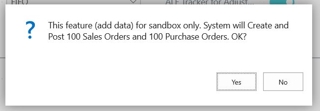

## ALF_Tracker_for_Adjust_Cost_Item_Entries

> Small extension for Dynamics 365 Business Central.
> App/Extension add possibility to track 'Adjust Cost - Item Entries' batch job (Elapsed Time, used filters).
> Plus the feature that add some sales orders/purchase orders (work for sandbox only, for test purpose).

As first step I need to create Dynamics 365 Business Central Development Sandbox Environment. 
More about Sandbox: [https://docs.microsoft.com/en-us/dynamics365/business-central/dev-itpro/developer/devenv-sandbox-overview](https://docs.microsoft.com/en-us/dynamics365/business-central/dev-itpro/developer/devenv-sandbox-overview "More about Sandbox Environment")

I decide to use Azure VM (Container Sandbox).

Use specific template for create Azure VM (need to have Azure subscription). 
Template link: [http://aka.ms/BCSandboxAzure](http://aka.ms/BCSandboxAzure "BCSandboxAzure")  

As result you should see on your Azure portal some VM.
// After running VM wait 30-40 mins… scripts are creating all necessary installs/tools.

Well, now stop a bit and try to dream about what our application should do.

App should save Start Time before run code in 'Adjust Cost - Item Entries' batch job and save End Time after run code in 'Adjust Cost - Item Entries' batch job.

'+' would be great to save which the Item filters has been set for this batch job.

And, of course we need to have some feature to build a bunch of documents (for Sandbox only). This is allowing to us do some tests not for a few documents only.

AL App/Extension based on events. We need to have some events in object Report 795 (Adjust Cost - Item Entries).

More about Events: [https://docs.microsoft.com/en-us/dynamics365/business-central/dev-itpro/developer/devenv-events-in-al](https://docs.microsoft.com/en-us/dynamics365/business-central/dev-itpro/developer/devenv-events-in-al "More about Events") 

Microsoft has done (and it is doing continuously) work on adding events to the standard code base.

If you see that standard code do not have necessary events just create new request (create new issue) via [https://github.com/Microsoft/ALAppExtensions/issues/](https://github.com/Microsoft/ALAppExtensions/issues/ "BC Event issues") (need to have GitHub account)

In case if fresh event requests not yet include in Azure VM Sandbox Environment, you could just add events (use DEV license and Object Designer).

All real SaaS / Cloud tenants updates time-to-time and after some time period (~ a month or more) after GitHub request – real tenants should have your events and you could try to install your app on production.

Now, some key pictures from Visual Code:

The good book for answer your questions: [https://www.packtpub.com/business/dynamics-365-business-central-development-quick-start-guide](https://www.packtpub.com/business/dynamics-365-business-central-development-quick-start-guide "Dynamics 365 Business Central Development Quick Start Guide")

And… App pictures:

P.S.
Use for version 13.1 or higher